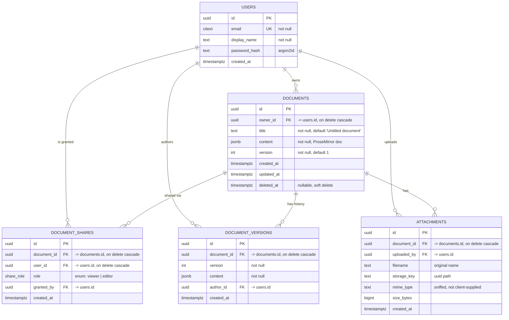
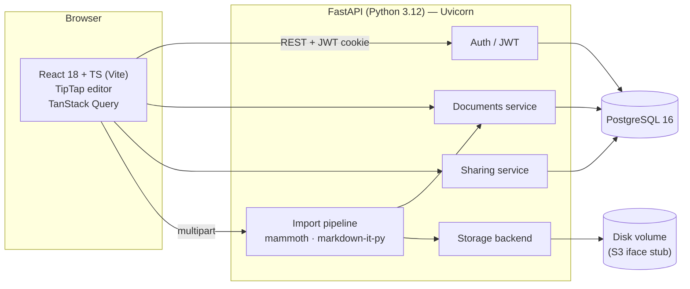

# DocEngine — Product Requirements Document

**Author:** Moses Yebei
**Date:** 2026-09-07
**Status:** Draft v1.0
**Context:** Ajaia LLC — AI-Native Full Stack Developer Assignment (4–6 hour timebox)

---

## 1. Summary

DocEngine is a lightweight collaborative document editor: create, edit, and share rich-text documents in the browser, with file import and persistent access control. It is a deliberately narrow slice of the Google Docs problem space — depth in editing, import, and sharing; nothing else.

**Stack:** React 18 + TypeScript (Vite, TipTap) · Python 3.12 + FastAPI · PostgreSQL 16 · Docker.

## 2. Goals and non-goals

### Goals
| # | Goal | Success measure |
|---|---|---|
| G1 | Usable rich-text editing | Bold/italic/underline/headings/lists round-trip through save→refresh→reopen with zero fidelity loss |
| G2 | Product-relevant file import | `.txt`, `.md`, `.docx` upload creates an editable document preserving headings, bold/italic, and lists |
| G3 | Comprehensible sharing | Owner grants viewer/editor access by email; recipient sees the doc in a distinct "Shared with me" surface |
| G4 | Durable persistence | Documents and grants survive restart; content stored as structured JSON, not opaque HTML strings |
| G5 | Reviewable delivery | One-command local run, live URL, seeded accounts, ≥1 meaningful automated test, architecture note |

### Non-goals (explicit scope cuts)
- **Real-time CRDT co-editing.** Highest-cost item by far. Last-write-wins with a version counter and a stale-write warning instead.
- **Comments, suggestions, version history browsing.** Version rows are written but not exposed in the UI.
- **Enterprise auth.** Seeded accounts + email/password with JWT. No SSO, no email verification, no password reset.
- **Images, tables, page layout, print pagination.** Text formatting only.
- **Public link sharing / org-wide roles.** Explicit per-user grants only.
- **Full DOCX fidelity.** Styles, footnotes, images, and tables are dropped on import; the UI says so.

## 3. Users and stories

**Personas:** *Owner* (creates and shares), *Collaborator* (invited editor), *Reviewer* (invited viewer).

| ID | As a… | I want to… | So that… | Priority |
|----|-------|-----------|----------|----------|
| US-1 | user | sign in with a seeded account | I can be identified as an owner | P0 |
| US-2 | owner | create a blank document | I can start writing | P0 |
| US-3 | owner | rename a document inline | it is findable later | P0 |
| US-4 | user | apply bold, italic, underline, H1–H3, bulleted and numbered lists | my document reads clearly | P0 |
| US-5 | user | have edits autosaved | I never lose work | P0 |
| US-6 | user | reopen a document and see identical formatting | persistence is trustworthy | P0 |
| US-7 | owner | upload a `.txt` / `.md` / `.docx` and get an editable doc | I can migrate existing content | P0 |
| US-8 | owner | grant another user viewer or editor access by email | we can collaborate | P0 |
| US-9 | user | see "My documents" and "Shared with me" separately | I know what I own | P0 |
| US-10 | owner | revoke access | sharing is reversible | P1 |
| US-11 | viewer | be blocked from editing in UI and API | permissions are real | P0 |
| US-12 | user | attach a file to an existing document | related material stays together | P1 |
| US-13 | user | export to Markdown | content is portable | P2 |
| US-14 | user | see who else has the doc open | I avoid clobbering | P2 (stretch) |

## 4. Functional requirements

### 4.1 Auth
- `POST /api/auth/login` → JWT access token (24 h), returned as an httpOnly cookie plus body for API clients.
- Passwords hashed with `argon2id`. Four seeded users (`alice@`, `bob@`, `carol@`, `dave@ajaia.test`, password `demo1234`) documented in the README.
- `POST /api/auth/register` supported; no email verification.
- All document routes require a valid token; 401 otherwise.

### 4.2 Documents
- `POST /api/documents` — create; body optional `{title}`; defaults to "Untitled document".
- `GET /api/documents?scope=owned|shared|all` — list with `id, title, updated_at, owner, my_role`.
- `GET /api/documents/{id}` — full content; requires `viewer`+.
- `PATCH /api/documents/{id}` — `{title?, content?, base_version}`; requires `editor`+.
- `DELETE /api/documents/{id}` — soft delete (`deleted_at`); owner only.
- **Content model:** TipTap/ProseMirror JSON in a `jsonb` column. Allowed node types are whitelisted server-side (`doc, paragraph, heading[1-3], bulletList, orderedList, listItem, text, hardBreak`) and marks (`bold, italic, underline`). Anything else is stripped — this is the XSS boundary.
- **Autosave:** debounced 800 ms after last keystroke, plus flush on blur and on `visibilitychange`. Optimistic UI with a `Saving…/Saved/Save failed — retry` indicator.
- **Concurrency:** each `PATCH` sends `base_version`; server rejects with `409` if `documents.version` has advanced. Client shows "This document changed elsewhere — reload to continue." No silent overwrite.

### 4.3 File import and attachments
| Type | Behavior |
|------|----------|
| `.txt` | Each blank-line-separated block → paragraph |
| `.md` | Parsed via `markdown-it-py` → HTML → ProseMirror JSON; headings, emphasis, lists preserved |
| `.docx` | `mammoth` → HTML → ProseMirror JSON; headings, bold/italic/underline, lists preserved. Images, tables, footnotes dropped with a banner listing what was discarded |

- `POST /api/documents/import` (multipart) → creates a document, returns its id.
- `POST /api/documents/{id}/attachments` — attach any file to an existing document; requires `editor`+.
- Limits: 5 MB, MIME sniffed with `python-magic` (not trusted from the client), extension whitelist. Rejections return `415` / `413` with a human-readable message rendered in the upload dialog. Limits are stated in the UI and README.
- Storage: local disk volume behind a `StorageBackend` interface with an S3 implementation stub; files keyed by UUID, original filename kept only as metadata.

### 4.4 Sharing
- Roles: `owner` (implicit, one per doc) > `editor` > `viewer`.
- `POST /api/documents/{id}/shares` `{email, role}` — owner only. Unknown email → `404` with "No user with that email" (deliberate: no invite-by-email flow in scope).
- `GET /api/documents/{id}/shares`, `DELETE /api/documents/{id}/shares/{user_id}` — owner only.
- Permission resolution is a single `require_role(doc_id, user, min_role)` dependency used by every document route. UI hiding is cosmetic only; the API is the enforcement point.
- Owner cannot be removed or demoted; owner transfer is out of scope.

### 4.5 Validation and errors
- Pydantic v2 models on every request body; `422` responses mapped to field-level form errors in the UI.
- Uniform error envelope: `{"error": {"code": "...", "message": "...", "field": null}}`.
- Global exception handler; no stack traces to clients; `structlog` JSON logs with a per-request correlation id.

## 5. Data model

### 5.1 ERD



### 5.2 Constraints and indexes
- `CREATE TYPE share_role AS ENUM ('viewer','editor');`
- `UNIQUE (document_id, user_id)` on `document_shares` — one grant per user per doc.
- `CHECK (user_id <> (SELECT owner_id …))` enforced in the service layer, not SQL (subqueries aren't allowed in checks); a partial unique index guards the owner-self-share case.
- `UNIQUE (document_id, version)` on `document_versions`.
- `INDEX documents(owner_id) WHERE deleted_at IS NULL`, `INDEX document_shares(user_id)`, `GIN` on `documents.content` (reserved for future search — not used in v1).
- `updated_at` maintained by a `BEFORE UPDATE` trigger.
- Version rows written on every 10th autosave and on explicit blur-flush, to bound write amplification.

### 5.3 Access resolution
```sql
SELECT CASE
  WHEN d.owner_id = :uid THEN 'owner'
  ELSE s.role::text
END AS role
FROM documents d
LEFT JOIN document_shares s ON s.document_id = d.id AND s.user_id = :uid
WHERE d.id = :doc_id AND d.deleted_at IS NULL
  AND (d.owner_id = :uid OR s.id IS NOT NULL);
```
Empty result ⇒ `404` (not `403` — do not leak document existence).

## 6. Architecture



**Layering:** `routers/` (HTTP + Pydantic) → `services/` (business rules, permission checks, transactions) → `repositories/` (SQLAlchemy 2.0 async). No SQLAlchemy objects cross into routers; no HTTP concepts reach services. This is what makes the permission logic unit-testable without a client.

**Migrations:** Alembic, checked in, run on container start.

## 7. Frontend

| Route | Screen |
|-------|--------|
| `/login` | Email/password, seeded-account hint chips |
| `/` | Two-tab list: **My documents** / **Shared with me** (badge shows role) + New / Import buttons |
| `/d/:id` | Editor: sticky toolbar, inline-editable title, save indicator, Share button, attachments drawer |

- **Editor:** TipTap (StarterKit trimmed to the whitelisted nodes + Underline). Keyboard shortcuts ⌘B/⌘I/⌘U, ⌘⌥1–3. Toolbar buttons reflect active marks.
- **Share dialog:** email input + role select, list of current grants with revoke, owner row pinned and non-removable.
- **State:** TanStack Query for server state; the editor owns document content locally and pushes via the debounced mutation. Optimistic list updates on rename.
- **Accessibility:** toolbar is a labelled `role="toolbar"` with `aria-pressed` on toggles; all dialogs focus-trapped; visible focus rings.
- **Empty/error/loading states** designed for every surface — no bare spinners on the list or editor.

## 8. Testing and quality

| Layer | Coverage |
|-------|----------|
| Unit (pytest) | `require_role` matrix: owner/editor/viewer/stranger × read/write/share/delete — **the meaningful test**; asserts a viewer gets 403 on PATCH and a stranger gets 404 |
| Unit (pytest) | DOCX→ProseMirror converter against a fixture with headings, nested lists, bold+italic |
| Unit (pytest) | Content sanitizer strips a `script` node and an `onclick` attr |
| Integration (httpx + testcontainers Postgres) | Create → edit → share → second user reads → revoke → 404 |
| Frontend (Vitest + RTL) | Toolbar toggles marks; save indicator transitions |
| CI (GitHub Actions) | ruff, mypy, pytest, tsc, vitest, docker build |

## 9. Deployment

- `docker compose up` → api, web, postgres. Single command local run.
- Live: Railway or Fly.io (both free-tier sufficient) with a managed Postgres; frontend served as static build from the API container to keep it one service and avoid CORS.
- Env: `DATABASE_URL`, `JWT_SECRET`, `MAX_UPLOAD_BYTES`, `STORAGE_DIR`.
- Seed script (`python -m app.seed`) idempotently creates the four demo users and two sample documents, one already shared, so reviewers can exercise sharing without setup.

## 10. Risks and tradeoffs

| Risk | Mitigation |
|------|-----------|
| DOCX fidelity is a rabbit hole | Ship mammoth's default mapping; document dropped features in the UI banner and README rather than chasing edge cases |
| Concurrent edits corrupt content | Optimistic version check + explicit conflict message; CRDT declared out of scope in writing |
| Timebox overrun | Build order is strictly P0 top-to-bottom (§3); stretch items only if all P0 tests pass |
| Rich-text content as an XSS vector | Server-side node/mark whitelist, not client-side sanitization |
| Sharing UI implies more security than exists | README states plainly that this is a demonstration access model, not enterprise ACL |

## 11. Build order (timeboxed)

| Slot | Work |
|------|------|
| 0:00–0:45 | Scaffold, docker compose, Alembic schema, seed |
| 0:45–1:45 | Auth + document CRUD + permission dependency + its unit tests |
| 1:45–3:00 | React shell, TipTap editor, autosave, list screens |
| 3:00–3:45 | Import pipeline (`.md`/`.txt`/`.docx`) + validation |
| 3:45–4:30 | Share dialog + grant/revoke + integration test |
| 4:30–5:15 | Deploy, README, architecture note, AI workflow note |
| 5:15–6:00 | Walkthrough video, buffer |

## 12. Out-of-scope backlog (the "next 2–4 hours" answer)

1. Yjs + `y-prosemirror` over WebSocket for true real-time co-editing with presence cursors.
2. Version history UI with diff and restore (rows already exist).
3. Export to PDF and Markdown.
4. Full-text search over `documents.content` using the existing GIN index.
5. Share-by-link with expiring tokens.
